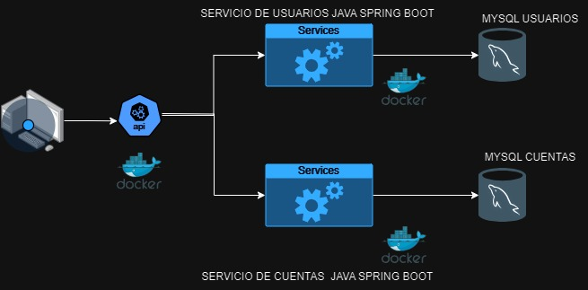

# Usuarios y Cuentas de una Entidad Financiera
Pablo Yacelga Miller

## Arquitectura de Microservicios con Spring Boot 3

Proyecto Final de Master

## Contenido

#### 1. Arquitectura del Sistema
#### 2. Diagrama general de Arquitectura 
#### 3. Descripción de los Microservicios y funcionalidades
#### 4. Instrucciones para la ejecución local de los microservicios con Docker
#### 5. Rutas de API, parámetros y ejemplos de uso. Sugerencia: Swagger

### 1. Arquitectura del Sistema
Se presenta el diseño e implementación de un Sistema para la gestión y usuarios y cuentas de una entidad financiera.

Se tiene por objetivo diseñar un modelo de arquitectura basad en Microservicios, aplicando Patrones de Diseño para solventar los principales eventos como riesgo en el funcionamiento en general del sistema.

### 2. Diagrama general de Arquitectura

### 3. Descripción de los Microservicios y funcionalidades

##### Spring-Boot
Forma parte de Spring Framework , el cual se optó para arrancar y configurar de forma rápida y sencilla aplicaciones basadas en Spring.

##### Proyecto Gradle
Herramienta de automatización de compilación del código abierto, que se ha implementado en el proyecto, ya que por su gran flexibilidad y tiempo de construcción facilita el desarrollo para proyectos de Java.

##### API REST​
Los microservicios necesitan una API para exponer ciertas funcionalidades a fin de interactuar e intercambiar datos con servicios de terceros, los microservicios pueden compartir datos y ayudar a las organizaciones a escalar las aplicaciones rápidamente a través de una interfaz bien definida mediante API ligeras.
En este caso con el framework de Spring Boot se crea un servicio web para que Spring reconozca una clase como servicio web y la trate como tal, debemos anotar la clase con @RestController.

##### Spring cloud
Se ha implementado en el proyecto para crear de forma rápida y sencilla aplicaciones distribuidas basadas en entornos en la nube y facilita la configuración de forma centralizada y “cloud-native”.

##### Spring-Cloud Gateway
Utilizado en el proyecto para centralizar las llamadas a la aplicación en una URI principal que redirige las llamadas a los servicios configurados internamente.

##### Spring Data
Utilizado eficazmente para ser uso de las anotaciones que pertenecen a Spring Boot y que permiten configurar de forma sencilla los Value Objects y los Data Transfer Objects para la persistencia en Base de datos.

##### Service Discovery
Proyecto en sí mismo basado en Spring Boot y Spring Cloud. Lo que hace es resolver las peticiones a los servicios de una aplicación compuesta por microservicios. Esto quiere decir, que es el encargado de llamar a las direcciones (endpoints o uris) de cada servicio, facilitando la invocación de los microservicios en este proyecto.

##### Service Registry
##### Microservicio encargado de registrar las direcciones a los microservicios que componen la aplicación y redireccionar las peticiones hacia estos:
Tecnología : Spring-Boot, Spring-Cloud y Netflix Eureka sobre Java 21
Funcionalidad : Encargado de redirigir las llamadas realizadas a cada servicio a través de una URI genérica a la dirección del servidor en el que se encuentra dicho servicio.

#### SERVIDOR EUREKA : localhot:8761

##### Spring Cloud Zimpkin
Se optó para visualizar o monitorear la traza de información de los diferentes microservicios a través de una interfaz gráfica.
Este facilita el rastreo de registros de una solicitud en particular cuando se produce un problema en el proceso de una funcionalidad.

##### Swagger
Interfaz gráfica utilizada en el proyecto para documentar la aplicación  de forma más sencilla y dinámica a través de una pantalla HTML a través de la dirección */swagger-ui.html:

##### Thymeleaf
THYMELEAF: Es un moderno motor de plantillas Java del lado del servidor para entornos web e independientes y con la implementación de la librería openhtmltopdf para generar PDF´s.
Reporte con la información del usuario y su cuenta:
SERVICIO REST:http://localhost:8081/report/pdf?userIdNumb=?

##### Postman
Herramienta propuesta para hacer más fácil las pruebas con aplicaciones web realizando peticiones específicas y analizar sus respuesta, en este caso las validaciones de los principales 2 Microservicios.

##### Circuit Breaker
Implementado en el proyecto para  evitar que una dependencia de recursos, como puede ser una petición HTTP o la consulta a una base de datos, se sobrecargue, de manera que no siga recibiendo más peticiones si no va a ser capaz de satisfacerlas

##### Despliegue con Docker
Herramienta que facilita el despliegue de los diferentes microservicios a través de la construcción de imágenes (Dockerfile.yml) , utilizado en este proyecto.
Implementando Docker compose para la configuración del despliegue entre los microservicios “User Service” & “Account Service” mediante el comando docker-compose up

##### Microservicio 1: User Service
##### Microservicio para la Gestión de Usuario, con las siguientes funcionalidades:
- Crear Usuario y crear la cuenta en el momento del registro, considerando:
- Cuenta de 10 dígitos
- Número de tarjeta débito 16 dígitos
- Pin de 4 dígitos
- Modificar datos de usuario:
- UserName
- Password
- Pin

##### Account Service
##### Microservicio para la Gestión de Cuenta, con las siguientes funcionalidades:
- Consultar información del Usuario:
- Número
- Saldo de la cuenta
- Tarjeta asociada
- Fecha apertura

##### Api-gateway
##### Servicio encargado de centralizar las llamadas a los demás servicios a través de una URI que hace de entrada de peticiones.
Tecnología : Api Rest, Spring-Boot, Spring-Cloud Gateway sobre Java 21.
Funcionalidad : Se encarga de centralizar las llamadas a la aplicación en una URI principal que redirige las llamadas a los servicios configurados internamente.

### 4. Instrucciones para la ejecución local de los microservicios con Docker

##### Iniciar Docker
Iniciar Docker Desktop
##### Ejecutar Jar
Crear jar en todos los Microservicios: java -jar build/libs/master-springboot-finalProject-0.0.1-SNAPSHOT.jar
##### Generar imagen docker
docker build --build-arg JAR_FILE=build/libs/\*.jar -t master-finalProject/spring-boot-m1 .
##### Ejecutar Docker compose
docker-compose up --build # proy_final_master_micro
